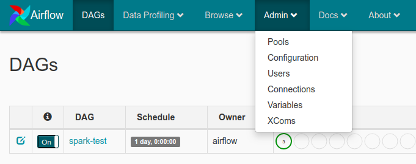

# Airflow Spark

This project contains the following containers:

* postgres: Postgres database for Airflow
    * Image: postgres:9.6
    * Database Port: 5432
    * References: https://hub.docker.com/_/postgres

* airflow-webserver: Airflow webserver and Scheduler
    * Image: docker-airflow-spark:latest
    * Port: 8282

* spark: Spark Master
    * Image: bitnami/spark:latest
    * Port: 8181
    * References: https://github.com/bitnami/bitnami-docker-spark

* spark-worker-N: Spark workers. You can add workers copying the containers and changing the container name inside the docker-compose.yml file
    * Image: bitnami/spark:latest
    * References: https://github.com/bitnami/bitnami-docker-spark

* jupyter-spark: Jupyter notebook with pyspark for interactive development
  * Image: jupyter/pyspark-notebook
  * Port: 8888
  * References: 
    * https://jupyter-docker-stacks.readthedocs.io/en/latest/using/selecting.html#jupyter-pyspark-notebook
    * https://hub.docker.com/r/jupyter/pyspark-notebook/tags/

## Architecture components


## Setup

### Clone project

    $ git clone https://github.com/cordon-thiago/airflow-spark

### Download Images

    $ docker pull postgres:9.6
    $ docker pull bitnami/spark:latest
    $ docker pull jupyter/pyspark-notebook:latest

### Build airflow Docker

Inside the airflow-spark/docker/docker-airflow

    $ docker build --rm -t docker-airflow-spark:latest .

### Start containers

Navigate to airflow-spark/docker and:

    $ docker-compose up

If you want to run in background:

    $ docker-compose up -d

### Check if you can access

Airflow: http://localhost:8282

Spark Master: http://localhost:8181

Jupyter Notebook: http://127.0.0.1:8888
  * For Jupyter notebook, you must copy the URL with the token generated when the container is started and paste in your browser. The URL with the token can be taken from container logs using:
  
        $ docker logs -f docker_jupyter-spark_1

## How to run a DAG to test

1. Configure spark connection acessing airflow web UI http://localhost:8080 and going to Connections
   

2. Edit the spark_default connection inserting `spark://spark` in Host field and Port `7077`
    

3. Run the spark-test DAG
   
4. Check the DAG log for the task spark_job. You will see the result printed in the log
   

5. Check the spark application in the Spark Master web UI (http://localhost:8181)
   

## Increasing the number of Spark Workers

You can increase the number of Spark workers just adding new services based on `bitnami/spark:latest` image to the `docker-compose.yml` file like following:

```
spark-worker-n:
        image: bitnami/spark:latest
        networks:
            - default_net
        environment:
            - SPARK_MODE=worker
            - SPARK_MASTER_URL=spark://spark:7077
            - SPARK_WORKER_MEMORY=1G
            - SPARK_WORKER_CORES=1
            - SPARK_RPC_AUTHENTICATION_ENABLED=no
            - SPARK_RPC_ENCRYPTION_ENABLED=no
            - SPARK_LOCAL_STORAGE_ENCRYPTION_ENABLED=no
            - SPARK_SSL_ENABLED=no
        volumes:
            - ../spark/app:/usr/local/spark/app # Spark scripts folder (Must be the same path in airflow and Spark Cluster)
            - ../spark/resources/data:/usr/local/spark/resources/data #Data folder (Must be the same path in airflow and Spark Cluster)

```

## Adding Airflow Extra packages

Rebuild Dockerfile (in this example, adding GCP extra):

    $ docker build --rm --build-arg AIRFLOW_DEPS="gcp" -t docker-airflow-spark:latest .

After successfully built, run docker-compose to start container:

    $ docker-compose up

More info at: https://github.com/puckel/docker-airflow#build

## Useful docker commands

    List Images:
    $ docker images <repository_name>

    List Containers:
    $ docker container ls

    Check container logs:
    $ docker logs -f <container_name>

    To build a Dockerfile after changing sth (run inside directoty containing Dockerfile):
    $ docker build --rm -t <tag_name> .

    Access container bash:
    $ docker exec -i -t <container_name> /bin/bash

## Useful docker-compose commands

    Start Containers:
    $ docker-compose -f <compose-file.yml> up -d

    Stop Containers:
    $ docker-compose -f <compose-file.yml> down --remove-orphans
    

